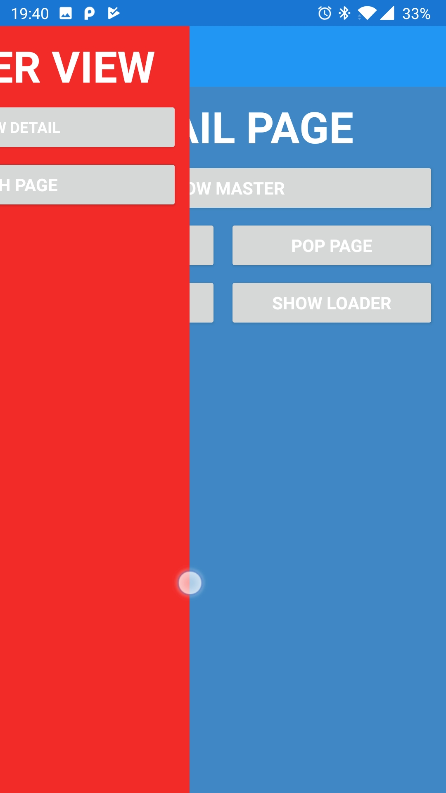

# Xamarin-Forms-MasterDetailPage
Alternative implementation for MasterDetailPage by Alin Andersen. Works, but still in development.
Not tested nor implemented on iOS (because I don't have any Apple machines).

# Milestones
- [X] IsBusy and custom loader support
- [X] Right side support
- [ ] Screen orientation support
- [ ] Update navigation toolbar items when side is flipped

# Video showcase

# Images
|-|-|-|
||||

